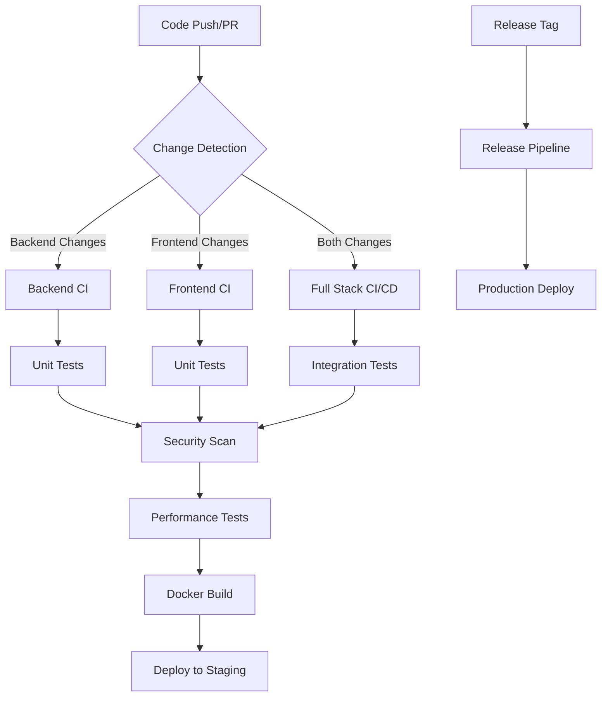

# GitHub Actions CI/CD Pipelines Documentation

This document provides a comprehensive overview of the GitHub Actions CI/CD pipelines configured for the SaaR Core Banking Services project.

## 📋 Table of Contents

- [Overview](#overview)
- [Pipeline Architecture](#pipeline-architecture)
- [Individual Pipelines](#individual-pipelines)
- [Configuration Guide](#configuration-guide)
- [Monitoring & Troubleshooting](#monitoring--troubleshooting)
- [Best Practices](#best-practices)

## 🎯 Overview

The Core Banking System uses a comprehensive CI/CD pipeline strategy with 6 main workflows:

1. **Backend CI** - .NET microservices testing and building
2. **Frontend CI** - Angular application testing and building
3. **Full Stack CI/CD** - Integrated workflow with smart change detection
4. **Security Scanning** - Comprehensive security and vulnerability analysis
5. **Performance Testing** - Load testing and performance monitoring
6. **Release Management** - Production deployment and release automation

## 🏗️ Pipeline Architecture



## 🔧 Individual Pipelines

### 1. Backend CI (`backend-ci.yml`)

**Triggers:**
- Push to `main`, `develop`, or `feature/*` branches
- Pull requests to `main` or `develop`
- Changes to `.cs`, `.csproj`, or configuration files

**Services:**
- PostgreSQL 15 database for testing
- Redis for caching (if configured)

**Steps:**
1. **Environment Setup**
   - .NET 8.0 SDK installation
   - Dependency restoration with caching
   
2. **Code Quality**
   - Code formatting validation
   - Build with warnings as errors
   - Static code analysis
   
3. **Testing**
   - Unit tests execution (50+ tests)
   - Code coverage reporting
   - Test result publishing
   
4. **Security & Packaging**
   - Vulnerability scanning with Trivy
   - NuGet package security audit
   - Docker image building (on main branch)

**Artifacts:**
- Test results and coverage reports
- Build artifacts for deployment
- Security scan reports

### 2. Frontend CI (`frontend-ci.yml`)

**Triggers:**
- Push to main branches
- Pull requests
- Changes to `frontend-ui/` directory

**Steps:**
1. **Environment Setup**
   - Node.js 18.x installation
   - NPM dependency installation with caching
   
2. **Code Quality**
   - ESLint code linting
   - Prettier formatting check
   - TypeScript compilation
   
3. **Testing**
   - Unit tests with Karma/Jasmine (8+ tests)
   - E2E tests with Cypress
   - Visual regression testing
   
4. **Performance & Build**
   - Lighthouse performance auditing
   - Production build optimization
   - Bundle size analysis
   
5. **Deployment**
   - Docker image creation with nginx
   - Static asset optimization

**Artifacts:**
- Test reports and coverage
- Lighthouse performance reports
- Optimized production build
- Docker images

### 3. Full Stack CI/CD (`fullstack-ci.yml`)

**Key Features:**
- **Smart Change Detection**: Only runs relevant tests based on file changes
- **Coordinated Testing**: Runs backend and frontend tests in parallel when both are affected
- **Integration Testing**: Full end-to-end testing with live services
- **Matrix Deployment**: Supports multiple environment deployments

**Change Detection Logic:**
```yaml
backend:
  - '**/*.cs'
  - '**/*.csproj'
  - '**/appsettings*.json'
  - 'Dockerfile*'
frontend:
  - 'frontend-ui/**'
docker:
  - '**/Dockerfile*'
  - 'docker-compose*.yml'
```

**Integration Testing:**
1. Starts PostgreSQL database
2. Launches backend services (CustomerService:5200, AccountService:5217)
3. Builds and serves frontend on port 4200
4. Runs comprehensive E2E tests
5. Validates API endpoints and UI functionality

**Docker Build Matrix:**
- `frontend-ui` - Angular app with nginx
- `AccountService` - Account management microservice
- `CustomerService` - Customer management microservice  
- `APIGateway` - API routing and authentication

### 4. Security Scanning (`security-scan.yml`)

**Comprehensive Security Analysis:**

1. **Static Analysis (CodeQL)**
   - Automated vulnerability detection
   - Security pattern analysis
   - Code quality assessment
   
2. **Container Security (Trivy)**
   - Docker image vulnerability scanning
   - Base image security assessment
   - Dependency vulnerability detection
   
3. **Dependency Auditing**
   - NuGet package security audit
   - NPM package vulnerability scan
   - License compliance checking
   
4. **Secret Detection**
   - Hardcoded credentials detection
   - API key exposure scanning
   - Configuration security validation

**Security Reports:**
- SARIF format security reports
- Vulnerability severity classification
- Remediation recommendations
- Compliance status reporting

### 5. Performance Testing (`performance-tests.yml`)

**Load Testing with K6:**
```javascript
// Example K6 test scenarios
- Constant load: 10 users for 2 minutes
- Ramp-up: 0 to 50 users over 5 minutes
- Spike test: Sudden load increase simulation
```

**Performance Metrics:**
- API response times
- Database query performance
- Memory and CPU utilization
- Concurrent user handling

**Lighthouse Auditing:**
- Performance score monitoring
- Accessibility compliance
- SEO optimization validation
- Progressive Web App features

**Database Performance:**
- Connection pool efficiency
- Query execution time analysis
- Index optimization recommendations

### 6. Release Management (`release.yml`)

**Triggered by:** Git tags matching `v*.*.*` pattern

**Release Process:**
1. **Version Management**
   - Automatic version extraction from git tags
   - Semantic versioning validation
   - Changelog generation from commit history
   
2. **Quality Assurance**
   - Full test suite execution
   - Security vulnerability assessment
   - Performance regression testing
   
3. **Artifact Creation**
   - Production-ready build generation
   - Docker image publishing to GHCR
   - Release asset packaging
   
4. **Deployment Automation**
   - Staging environment deployment
   - Production deployment (with approval)
   - Rollback procedures
   
5. **Notification & Documentation**
   - Release notes generation
   - Team notifications (Slack/Teams)
   - Documentation updates

## ⚙️ Configuration Guide

### Required Secrets

Set these in your GitHub repository settings (`Settings > Secrets and variables > Actions`):

```bash
# Container Registry
DOCKER_USERNAME=your_dockerhub_username
DOCKER_PASSWORD=your_dockerhub_token
GITHUB_TOKEN=automatically_provided

# Database Connections
DATABASE_CONNECTION_STRING=Server=localhost;Database=testdb;User Id=postgres;Password=postgres;
PROD_DATABASE_CONNECTION_STRING=your_production_db_connection

# Notification Services
SLACK_WEBHOOK_URL=https://hooks.slack.com/services/YOUR/SLACK/WEBHOOK
TEAMS_WEBHOOK_URL=https://your_teams_webhook_url

# Performance Testing
K6_CLOUD_TOKEN=your_k6_cloud_token (optional)
LIGHTHOUSE_SERVER_URL=your_lighthouse_ci_server (optional)

# Deployment
KUBERNETES_CONFIG=your_base64_encoded_kubeconfig
HELM_REPOSITORY_URL=your_helm_chart_repository
```

### Environment Configuration

Create environment-specific configurations in GitHub:

1. **Development Environment**
   - Automatic deployment on feature branch merges
   - Relaxed security policies
   - Detailed debugging information

2. **Staging Environment**
   - Manual approval required
   - Production-like configuration
   - Full test suite execution

3. **Production Environment**
   - Manual approval required
   - Multiple approvers needed
   - Comprehensive backup before deployment

### Branch Protection Rules

Configure these branch protection rules:

```yaml
main:
  required_status_checks:
    - "Backend Tests"
    - "Frontend Tests"
    - "Security Scan"
    - "Performance Tests"
  require_pull_request_reviews: true
  required_approving_review_count: 2
  dismiss_stale_reviews: true
  require_code_owner_reviews: true
  restrict_pushes: true
```

## 📊 Monitoring & Troubleshooting

### Pipeline Monitoring

**Key Metrics to Monitor:**
- Build success rate (target: >95%)
- Test execution time (target: <10 minutes)
- Security scan results (0 high/critical vulnerabilities)
- Performance regression (response time <500ms)

**Notification Channels:**
- Slack/Teams for build failures
- Email for security alerts
- Dashboard for performance metrics

### Common Issues & Solutions

1. **Build Timeouts**
   ```yaml
   # Increase timeout in workflow
   timeout-minutes: 30
   ```

2. **Database Connection Issues**
   ```yaml
   # Ensure proper health checks
   options: >-
     --health-cmd pg_isready
     --health-interval 10s
     --health-timeout 5s
     --health-retries 5
   ```

3. **Docker Build Failures**
   ```yaml
   # Use multi-stage builds and proper caching
   cache-from: type=gha
   cache-to: type=gha,mode=max
   ```

4. **Test Flakiness**
   ```yaml
   # Implement retry logic
   - name: Run tests with retry
     uses: nick-invision/retry@v2
     with:
       timeout_minutes: 10
       max_attempts: 3
   ```

### Debug Mode

Enable debug logging by setting repository secret:
```bash
ACTIONS_STEP_DEBUG=true
ACTIONS_RUNNER_DEBUG=true
```

## 🚀 Best Practices

### 1. Workflow Optimization
- Use caching for dependencies (npm, NuGet, Docker layers)
- Implement change detection to avoid unnecessary builds
- Parallelize independent jobs
- Use matrix builds for multiple environments

### 2. Security Best Practices
- Never store secrets in code
- Use least privilege access principles
- Regularly update action versions
- Implement secret scanning

### 3. Performance Optimization
- Optimize Docker image sizes
- Use multi-stage builds
- Implement proper caching strategies
- Monitor resource usage

### 4. Testing Strategy
- Maintain high test coverage (>80%)
- Implement fast feedback loops
- Use parallel test execution
- Include integration and E2E tests

### 5. Deployment Safety
- Implement blue-green deployments
- Use feature flags for gradual rollouts
- Maintain rollback procedures
- Test deployment scripts in staging

## 📚 Additional Resources

- [GitHub Actions Documentation](https://docs.github.com/en/actions)
- [.NET CI/CD Best Practices](https://docs.microsoft.com/en-us/dotnet/devops/)
- [Angular Deployment Guide](https://angular.io/guide/deployment)
- [Docker Multi-stage Builds](https://docs.docker.com/develop/dev-best-practices/multistage-build/)
- [Security Scanning with Trivy](https://aquasecurity.github.io/trivy/)

## 🤝 Contributing

When modifying workflows:

1. Test changes in a feature branch first
2. Update this documentation for any significant changes
3. Ensure backward compatibility
4. Add appropriate comments in YAML files
5. Follow security best practices

---

**Last Updated:** July 2025  
**Version:** 1.0.0  
**Maintained by:** SaaR Solutions Development Team
